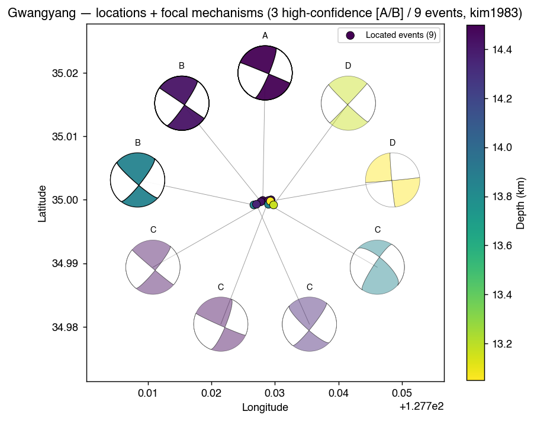
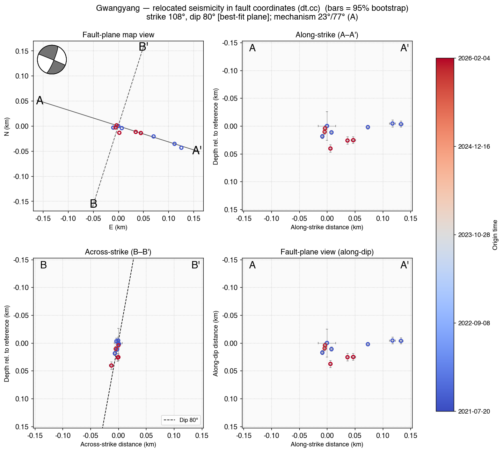

# korea-cluster-relocation

A unified, parameterized **earthquake-cluster relocation framework**: one codebase
(`pipeline/`) reproduces a per-cluster relocation workflow for *any* cluster that follows
the same directory layout — **a cluster is a config, not a fork of the code**.

```
KMA catalog ─▶ event-window SAC ─▶ AI picking (SeisBench PhaseNet)
            ─▶ HYPOINVERSE absolute location (N velocity models)
            ─▶ re-reference origins ─▶ HypoDD relative relocation (dt.ct catalog + dt.cc cross-correlation)
```

It was built from four Korean clusters (Gwangyang, Kimcheon, Jangsung, Gyeongju — KS/KG
networks, KMA-archive **and** STP-SAC waveform backends) and validated against their frozen
results. **Non-destructive by design:** the framework only ever writes under
`pipeline/runs/<cluster>/`; your cluster directories are read-only inputs (a `config.assert_writable`
guard refuses any write inside them).

> This repository tracks the **framework code + docs + notebooks only**. Waveforms and
> per-cluster baselines stay on your machine — point the configs at your own cluster dirs.

## Install

```bash
git clone https://github.com/seismoseo/korea-cluster-relocation.git
cd korea-cluster-relocation
bash tools/setup-git-filters.sh          # once: strips notebook outputs on commit
export PYTHONPATH=$(pwd)                  # so `import pipeline` works
```
- **Python** (miniforge): `obspy`, `seisbench` (+ `torch`), `pandas`, `numpy`, `matplotlib`. *Optional:*
  `plotly` for the interactive 3-D view (`viz.plot_3d_plane`), `kaleido` to export it to a static PNG.
- **External binaries on `PATH`** (not pip-installable): `hyp1.40` (HYPOINVERSE), `ncsn2pha`,
  `ph2dt`, `hypoDD`.
- `config.PROJECT_ROOT` auto-derives from the repo location (`pipeline/config.py`'s parent), so a
  clone works at any path — the only invariant is that `pipeline/` sits one level under the repo
  root with the cluster dirs as its siblings.

## Directory convention (per cluster)

Each cluster is a sibling directory of `pipeline/` with this layout (only the small reference
files need to exist up front; the rest are produced by the pipeline or supplied by you):

```
<ClusterDir>/                         # e.g. Gwangyang_sequence/
  event_catalog/event_catalog.csv     # KMA catalog: Year,Month,Day,Hour,Minute,Second,Latitude,Longitude,Depth,Magnitude (KST)
  station_table/KS_station.csv        # master station table(s): Network,Code,Latitude,Longitude,Elevation [,Borehole]
  kma_waveforms/<event_id>/...        # KMA-archive backend: per-event raw SAC  (or)
  stp_download/SAC/<event_id>/{HH,HG,EL}/...   # STP-SAC backend: per-event raw SAC in sensor subdirs
  1.HypoInv/<velmodel>/<vm>_p.crh, <vm>_s.crh  # crustal models (HYPOINVERSE .crh)
  1.HypoInv/<Region>.sh                # HYPOINVERSE control block (CON/MIN/ZTR/DIS/RMS/...)
  2.HypoDD/00.ph2dt, 01.dt.ct, 02.dt.cc        # (frozen baselines, if you have them, for regression)
```
Event ids are the **UTC** origin time `YYYYMMDDHHMMSS` (= `catalog_KST − kst_offset_hours`), which is
also the raw per-event directory name. Framework outputs mirror this layout under
`pipeline/runs/<cluster>/`.

## Run

```bash
cd korea-cluster-relocation
PY=python    # or /path/to/miniforge3/bin/python

# catalog (dt.ct) chain for a cluster (PhaseNet on CPU to match the reference run):
$PY -m pipeline.cli.run_pipeline --cluster gwangyang
$PY -m pipeline.cli.run_pipeline --cluster kimcheon --stage-from picking --through hypoinverse

# dt.cc branch (rereference -> xcorr -> dtcc) is HEAVY — PIN CORES on a shared box:
taskset -c 0-9 $PY -m pipeline.cli.run_pipeline --cluster gwangyang --through dtcc --cores 10

# focal mechanisms: pick with PhaseNet+ (emits polarity + S/P amplitude), then SKHASH:
$PY -m pipeline.cli.run_pipeline --cluster gwangyang --picker phasenet_plus --through hypoinverse
$PY -m pipeline.cli.run_pipeline --cluster gwangyang --picker phasenet_plus \
    --stage-from focal_mechanism --through focal_mechanism

# regression vs your frozen baselines:
$PY -m pipeline.cli.compare --cluster gwangyang
```
Stages: `stations waveforms picking hypoinverse ph2dt dtct rereference xcorr dtcc` (+ opt-in
`focal_mechanism`). The default `--through dtct` runs the catalog chain; the dt.cc branch is appended
only when requested.

**Picker / focal mechanisms.** `--picker` (or `cfg.picker_weights`) selects `stead` (default, SeisBench
PhaseNet) or `phasenet_plus` (EQNet PhaseNet+), the latter additionally emitting first-motion polarity +
amplitude. The opt-in `focal_mechanism` stage feeds those into **SKHASH** (double-couple inversion; keeps
quality A/B). EQNet and SKHASH are external tools — set `$EQNET_DIR` / `$SKHASH_DIR` (see `pipeline/config.py`).

## Controlled, stage-by-stage workflow (recommended)

For a fully-controlled run where you **inspect each intermediate product and tune parameters**, open
`pipeline/notebooks/02_controlled_run.ipynb` in JupyterLab, set `CLUSTER`, and run stage by stage.
Each stage is **PARAMS → RUN → INSPECT → PLOT**; tuning uses `config.tune()`, which returns a
modified *copy* of the frozen config (dict fields like `xcorr`/`pick_window` merge; nested blocks
like `hyp_control`/`ph2dt` take field overrides):

```python
cfg = config.tune(cfg0, p_threshold=0.15)               # scalar
cfg = config.tune(cfg,  xcorr=dict(slide_step=0.001))   # merge into the xcorr dict
cfg = config.tune(cfg,  hyp_control=dict(MIN=6))        # nested replace
```

**Re-run discipline:** stage 6 (`rereference`) rewrites SAC origins in place (prerequisite for
dt.cc). If you re-tune **picking** afterwards, re-run the unit *waveforms → picking → hypoinverse →
ph2dt+dtct → rereference* (re-running `waveforms` first resets origins to catalog time). `xcorr`
cross-correlates **all** event pairs — keep iterations cheap with a small `SUBSET` and a coarse
`xcorr.slide_step` (0.01); use `0.001` for the final product, under `taskset`.

Auxiliary QC (station misorientation, ZRT rotation, waveform similarity) is in
`pipeline/notebooks/01_qc.ipynb`; a quick run-all + regression dashboard is `00_run_and_inspect.ipynb`.
**Results presentation** — locations and focal mechanisms together — is one notebook per cluster,
`03_results_<cluster>.ipynb` (gwangyang / kimcheon / jangsung / gyeongju), each with `CLUSTER` /
`RUN_SUFFIX` set at the top.

## Example — Gwangyang focal mechanisms

Run the full pipeline with PhaseNet+ (emits polarity + S/P amplitude), then invert with SKHASH:

```bash
PY=python
# full relocation chain with the PhaseNet+ picker (pin cores — xcorr is heavy):
taskset -c 0-9 $PY -m pipeline.cli.run_pipeline --cluster gwangyang --picker phasenet_plus \
    --through dtcc --cores 10
# focal mechanisms:
$PY -m pipeline.cli.run_pipeline --cluster gwangyang --picker phasenet_plus \
    --stage-from focal_mechanism --through focal_mechanism
# then view: pipeline/notebooks/03_results_gwangyang.ipynb  (CLUSTER="gwangyang", RUN_SUFFIX="_pnplus")
```

The PhaseNet+ HypoDD relocation agrees with the trusted `stead` baseline to ≈100 m (depth within
≈0.3 km). Polarities are used only from P picks with probability ≥ `fm_min_pick_prob` (0.5), and S/P
ratios only where the P and S SNR ≥ `fm_sp_min_snr` (3). Of the 11 events, **3 are well constrained
(quality A/B)** and agree closely — near-vertical, roughly N-striking strike-slip — a coherent fault source:

| Event | Quality | Strike | Dip | Rake | Fault-plane uncert. | P polarities | S/P ratios |
|---|---|---|---|---|---|---|---|
| 20210827220322 | A | 23 | 77 | −179 | 18° | 46 | 49 |
| 20210827002315 | B | 34 | 80 | −180 | 12° | 33 | 43 |
| 20210720161418 | B | 38 | 76 | 169 | 27° | 14 | 16 |



*Located epicenters (depth-coloured dots) with the high-confidence beachballs offset on a ring
(leader line to each epicenter); polarity is the primary signal, the vertical-component S/P ratio a
secondary enhancement. The lower-quality (C/D) solutions are kept only for context.*



*The dt.cc relocation rotated into the fault frame (`viz.fault_sections`): fault-plane map view,
along-strike (A–A') and across-strike (B–B') depth sections, and the fault-plane along-dip view, coloured
by origin time. The orientation is the relocation cloud's best-fit plane (strike ≈ 108°, dip ≈ 80°) — which
coincides with the focal mechanism's nodal plane — and the tight across-strike spread confirms a
near-vertical, near-planar fault.*

`03_results_<cluster>.ipynb` shows all the key figures together: locations (absolute `.sum` + the headline **dt.cc**
relocation; `viz.relocation_counts` tabulates the per-stage event counts), **picks with first-motion
polarity** (`viz.plot_3c` + `viz.plot_polarities`, a P-aligned record section sorted by azimuth), the
focal mechanisms above, and **`viz.fault_sections`** — the relocated catalog rotated into the fault frame
(a 2×2 figure: fault-plane map view, along-strike + across-strike depth sections, and a fault-plane
along-dip view), coloured by origin time and **oriented to the relocation cloud's own best-fit plane
(SVD), with the focal mechanism overlaid for comparison** (pass `strike=`/`dip=` to override).
`viz.mechanism_table` lists **both nodal planes** (`strike/dip/rake` = NP1 from SKHASH, `strike2/dip2/rake2`
= the conjugate NP2 via obspy `aux_plane`); `viz.plot_3d_plane` is the interactive plotly view with the
best-fit plane sized to **span the cloud's actual extent** (projected onto the in-plane axes, so an
asymmetric cloud is fully covered).

**Located-event counts shrink `.sum ≥ dt.ct ≥ dt.cc`.** `.sum` is every event HYPOINVERSE locates
absolutely; **dt.ct** keeps only events with enough catalog differential-time links (isolated events
drop); **dt.cc** re-clusters on waveform cross-correlation and keeps only well-correlating events.
**dt.cc is the high-end product** (location errors of metres vs tens of metres for dt.ct) — it is the
headline relocation in the notebooks.

**Adaptive LSQR dt.cc tuning (automatic & reproducible).** When a cluster's dt set is too large for
HypoDD's compiled SVD array (`MAXDATA0`), the dt.cc run must use **LSQR** (`isolv=2`). LSQR then needs
the damping and inter-event distance cutoffs chosen well, or poorly-linked events destabilise the
solution. The `dtcc` stage does this automatically, with no manual tuning:

1. **Distance cutoffs scaled to cluster size** — `WDCC`/`WDCT` are scaled by the dt.ct cluster diameter
   (`core/hypodd._scale_distance_cutoffs`, ref 1.5 km), so a compact cluster cuts long-distance pairs and
   spatially peripheral / zero-cross-correlation events drop out of the relocation.
2. **Per-set DAMP auto-tuned to a well-conditioned solution** — `core/hypodd._exec_hypodd` reads the
   per-iteration condition number from `hypoDD.log` and re-runs, nudging each weighting set's `DAMP` until
   the condition number lands in HypoDD's recommended **~40–80** band (the search is logged to
   `damping_calibration.txt`).

This is *code*, run on every pipeline invocation, and **deterministic** — re-running from scratch yields a
byte-identical `hypoDD.reloc` and the same chosen DAMP. (Example: Kimcheon's condition number dropped from
~196 to ~60, three uncorrelated fliers — one at 8 km depth — were removed, and the best-fit fault plane
went from a corrupted 322° to 40°, matching the focal mechanisms.) Only LSQR dt.cc runs are affected; SVD
runs and the dt.ct baselines are untouched.

**Bootstrap location uncertainty (95% error bars).** HypoDD's a-posteriori LSQR errors badly underestimate
the true relative-location uncertainty (Kimcheon dt.cc: internal ex/ey/ez ≈ 0.3/0.3/1 m vs **bootstrap median
≈ 4/4/52 m** — ~50–300×, depth worst). `core/hypodd.bootstrap_relocation` estimates it data-driven: pool all
differential-time observations, **resample with replacement** (global), regroup into pairs, and re-run HypoDD
`n` (≈1000) times with the **inversion held fixed** (the calibrated `hypoDD.inp`). Each replica is
**seeded from the converged relocation** (so the error is the data-driven spread around the solution, not
each replica's ability to re-converge from a poor initial absolute location) and **median-aligned**; the
per-event 95% error bar is the **2.5–97.5 percentile half-width** of the X/Y/Z scatter (percentile, not σ —
robust to the heavy tail of the global resample). It is **seeded/reproducible** and **cached**
(`bootstrap_errors.csv` + per-replica `bootstrap_samples.npz`). Run it (opt-in, heavy) for the
clusters/branches you plot:

```bash
python -m pipeline.cli.bootstrap --cluster kimcheon --suffix _pnplus --branch both --n 1000 --cores 10
```

Once the cache exists, `viz.map_catalog`/`depth_sections`/`compare_epicenters`/`fault_sections`/`plot_3d_plane`
draw the 95% bars automatically (E/N on the map view, rotated into along/across/depth for the fault sections,
3-D `error_x/y/z` whiskers — or, with `plot_3d_plane(..., error="ellipsoid")`, a translucent 95% bootstrap
**error ellipsoid** per event) and **drop events the bootstrap flags as under-constrained** (95% horizontal
half-width > 0.1 km or `n_boot` < 0.6·n; tunable module constants `viz.BOOT_DROP_HORIZ_KM` /
`viz.BOOT_DROP_MIN_NBOOT_FRAC`), noting the count. Hypocentre **circles scale by KMA local magnitude** in every
scatter (the reloc `mag` is 0, so the catalog magnitude is used, matched cuspid→event_id→catalog row
case-insensitively across all four clusters). `viz.location_table` is the **headline deliverable** — one neat
row per event (location + KMA magnitude + bootstrap 95% half-widths `ex95_m`/`ey95_m`/`ez95_m` + `n_boot` +
link counts + `under_constrained` flag), written to **`final_locations.csv`** in the dt.cc run dir and shown
styled in the notebook. `03_results_<cluster>.ipynb` computes/loads the bootstrap and tabulates
bootstrap-vs-internal. *(Example: Kimcheon 200007 has good CC and a recovered main location, but is shallow
with a 121° azimuthal gap → genuinely under-determined, so it's dropped.)*

**Other clusters.** All four clusters relocate (locations + dt.cc), but only **Gwangyang** has the
focal-sphere coverage for *well-constrained* mechanisms. Jangsung/Kimcheon events are shallow (~0.3–6 km),
so the steep takeoffs are unsampled (takeoff gap > 60°); Gyeongju's stations are one-sided (azimuthal
gap > 90°). With the SKIP thresholds relaxed (`fm_max_agap`/`fm_max_pgap`) those clusters still get
mechanisms, but SKHASH grades them **D** (under-constrained) — a magnitude-2.4 event is no exception, as
mechanism resolvability depends on focal-sphere coverage, not magnitude.

## Adding a new cluster

1. Create the cluster directory (above) as a sibling of `pipeline/`.
2. Write `pipeline/clusters/<name>.py`:
   - **KMA-archive** clusters are one call to the factory:
     ```python
     import os
     from pipeline import config
     from pipeline.clusters._base import kma_cluster
     CONFIG = kma_cluster(name="<name>", region="<Region>",
                          src_root=os.path.join(config.PROJECT_ROOT, "<ClusterDir>"),
                          epicenter=(lat, lon), region_bounds=(la0, la1, lo0, lo1),
                          dtct_isolv=1)   # 2 = LSQR for large clusters (SVD MAXDATA0 overflow)
     ```
   - **STP-SAC** clusters (sensor-subdir layout, multi-network) are a bespoke `ClusterConfig`
     with `wf_source="stp_sac"` + `stp_sac_glob` + multiple `station_master_csvs` — see
     `pipeline/clusters/gyeongju.py` as the template.
3. Register the name in `config.CLUSTER_NAMES` and the directory in `config.CLUSTER_SRC_DIRS`.
4. (Optional) freeze regression baselines: `python -m pipeline.regression.freeze_baseline freeze`.

## Regression

`python -m pipeline.cli.compare --cluster <name>` reports PASS/FAIL per stage against frozen
baselines: stations (exact), picks (≥95% within 0.1 s), `.sum` (event count + epicenter/depth/RMS
tolerances), dt.ct `.reloc` (rigid translation **separated** from centroid-aligned relative error —
`shape_corr` is the cluster-geometry fidelity). dt.cc is **report-only** (hand-tuned, judgment-
dependent). `freeze_baseline {freeze,verify}` manages the SHA-256 manifest. Details + the validation
table: [`pipeline/README.md`](pipeline/README.md).

## Layout

```
pipeline/        config.py (+ tune, path resolvers, write guard) · clusters/ · core/ ·
                 analysis/ · regression/ · viz.py · cli/ · notebooks/ · runs/ (gitignored)
tools/           nbstrip.py + setup-git-filters.sh (notebook output stripping)
README.md        this file        CLAUDE.md   guidance for Claude Code
```
See [`pipeline/README.md`](pipeline/README.md) for stage internals, the determinism/validation
table, and findings.
